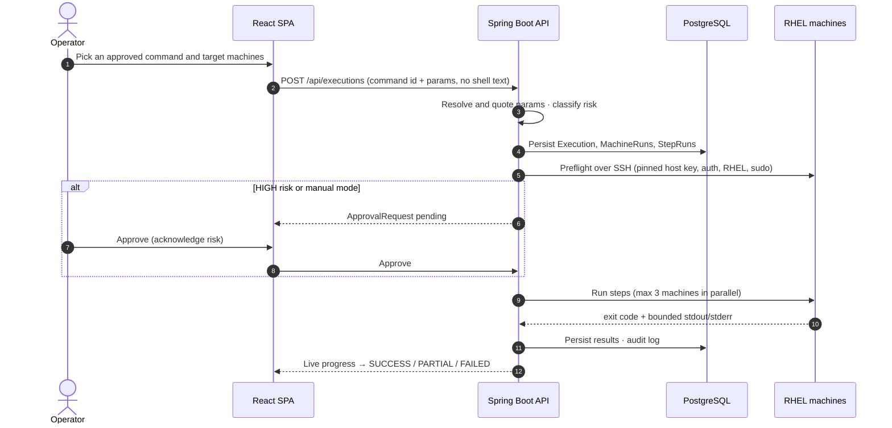
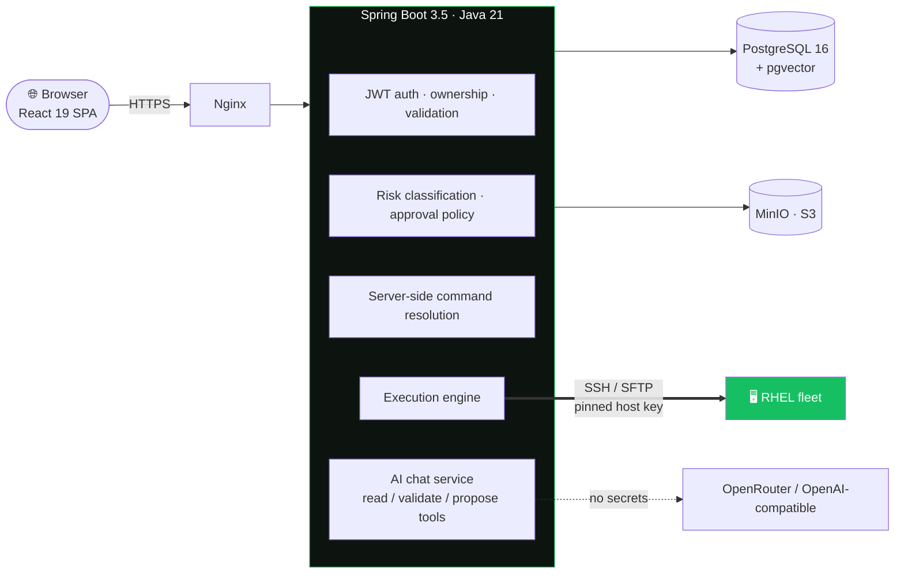

<div align="center">



<br/>

[](#tech-stack)
[](#tech-stack)
[](#tech-stack)
[](#tech-stack)
[](#tech-stack)
[](#quick-start-docker-compose)

**[What it does](#what-it-does)** · **[How a run works](#how-a-run-works)** · **[Architecture](#architecture)** · **[Engineering highlights](#engineering-highlights)** · **[Quick start](#quick-start-docker-compose)** · **[Docs](#documentation)**

</div>

---

## The problem

Operations teams that look after fleets of RHEL servers often work by SSH-ing into each box and pasting commands
from a wiki. Nothing checks those commands first, nobody signs off on risky ones, and nothing records what ran where.

**AutoOps replaces that with one controlled path.** Commands come from an approved **Command Bank**. They can be
chained into typed **workflows**, and they run through a central **execution engine** with preflight checks,
approval gates, live progress and a full audit history. An **AI assistant** can find commands, draft workflows
and explain failures, but it never executes anything itself.

<table>
<tr>
<td align="center" width="25%"><h3>156</h3><sub>Java classes in a modular Spring Boot monolith</sub></td>
<td align="center" width="25%"><h3>17</h3><sub>versioned Flyway migrations</sub></td>
<td align="center" width="25%"><h3>11</h3><sub>AI tools, all read / validate / propose only</sub></td>
<td align="center" width="25%"><h3>EN · HE</h3><sub>full English and Hebrew (RTL) UI</sub></td>
</tr>
</table>

## What it does

<table>
<tr>
<td width="50%" valign="top">

### 📚 Command Bank
A catalog of reviewed shell commands with typed parameter schemas. Only **APPROVED** commands can run.
Parameters are validated, then quoted and resolved **on the server**. The browser never sends a raw shell string.

</td>
<td width="50%" valign="top">

### 🧩 Typed workflows
Multi-step plans with success and failure edges. A step can run a command, transfer a file
(SFTP + SHA-256 verification) or *wait until* a service is active, a file exists or a command succeeds.

</td>
</tr>
<tr>
<td valign="top">

### ⚙️ One execution engine
Command runs and workflow runs share the same path: **preflight → approval gate → run → aggregate**.
It runs on several machines at once, with stop and retry, bounded output capture and safe recovery after a restart.

</td>
<td valign="top">

### 🔐 Pinned SSH host trust
The user confirms a host's fingerprint once. After that, every session must present exactly that key.
A changed key aborts before authentication and blocks all remote work until someone re-confirms it.

</td>
</tr>
<tr>
<td valign="top">

### 🤖 AI assistant that proposes, never executes
Native tool calling over an OpenAI-compatible API. It can search commands, draft workflows and explain
failed runs. Every proposal is re-validated in Java and then **reviewed by a human** in the normal UI.

</td>
<td valign="top">

### 🧾 Approvals and audit
Risk is classified on the server. HIGH-risk runs always need an acknowledged approval. Security events,
from logins to host-key mismatches, are written to a sanitized audit log that admins can view.

</td>
</tr>
</table>

## How a run works



## Architecture



The trust boundary is simple: **the browser and the AI propose, Spring Boot decides.** Authorization, ownership,
validation, risk classification, approval policy, command resolution and SSH host verification all happen on the
server. The AI has no SQL, shell, SSH, HTTP or filesystem tools and never sees credentials. Everything works without AI too.

## Engineering highlights

| Area | What I built | Why it matters |
| --- | --- | --- |
| **Command safety** | `StepResolver` re-resolves each step at creation, in preflight and right before it runs | A command that is un-approved halfway through a run can't sneak through |
| **Host trust** | OpenSSH `SHA256:` fingerprints, constant-time comparison, a per-session key repository holding only the trusted key | Stops machine-in-the-middle attacks on every SSH session |
| **Secrets** | Machine passwords encrypted with AES-256-GCM (random IV). They are never returned, logged or sent to the AI | A database leak doesn't expose server credentials |
| **Sessions** | Short-lived JWT access tokens plus rotating opaque refresh tokens (SHA-256 hashed). Reusing an old token revokes every session | Stolen refresh tokens are caught and shut down |
| **Concurrency** | Parallel preflight and run (1–3 machines) with `STOP_NEW_MACHINES` / `CONTINUE` failure policies | Mistakes don't spread silently across the fleet |
| **Resilience** | Stop, retry of the latest failed step, and `ExecutionRecovery` for in-flight runs on startup | No run is left stuck in a half-finished state |
| **AI guardrails** | At most 3 tool rounds, bounded context, and Java re-validation of every proposed operation (`AIOperationValidator`) | The model helps, but it can't change anything by itself |
| **i18n** | English and Hebrew as equal UIs with correct LTR/RTL. Paths, code and addresses stay LTR | Built for real bilingual operations teams |

## Tech stack

| Layer | Technology |
|---|---|
| Frontend | React 19, TypeScript, Vite, TanStack Query, React Router, Lucide, English/Hebrew (RTL) |
| Backend | Java 21, Spring Boot 3.5, Spring Security (JWT + rotating refresh cookie), JPA, Flyway |
| Data | PostgreSQL 16 + pgvector, MinIO (S3) |
| Remote | JSch SSH/SFTP with pinned host keys |
| AI | OpenRouter / OpenAI-compatible chat completions with native tool calling (optional) |
| Delivery | Docker Compose, Nginx, GitHub Actions CI (Maven tests + frontend type-check/build) |

## Quick start (Docker Compose)

```bash
cp .env.example .env          # fill in every REQUIRED value
docker compose --env-file .env -f deploy/docker-compose.yml up --build
```

Open http://localhost:8088 and sign in with `AUTOOPS_ADMIN_USERNAME` / `AUTOOPS_ADMIN_PASSWORD`.
Then: add a credential → add a machine → **Trust host key** → **Test** → run a command from the Command Bank.

<details>
<summary><b>Local development</b></summary>

```bash
# backend (needs PostgreSQL with pgvector, and MinIO or another S3 endpoint)
cd backend && JWT_SECRET=... CREDENTIAL_ENCRYPTION_KEY=... MINIO_SECRET_KEY=... COOKIE_SECURE=false mvn spring-boot:run
# frontend (proxies /api to localhost:8080)
cd frontend && npm ci && npm run dev
```

Checks: `cd backend && mvn test` and `cd frontend && npm run build` (includes an i18n key check and type check).

</details>

## Documentation

- [Architecture](docs/ARCHITECTURE.md) · [API](docs/API.md) · [Execution engine](docs/EXECUTION_ENGINE.md)
- [Security](docs/SECURITY.md) · [Deployment & configuration](docs/DEPLOYMENT.md) · [AI](docs/AI.md)
- [Database](docs/DATABASE.md) · [Frontend](docs/FRONTEND.md) · [Prompts](docs/PROMPTS.md)
- [V1 completion plan and progress](docs/CODE_AGENT_MASTER_PLAN.md)

---

<div align="center">

**Built by [Ilay Admoni](https://github.com/ilayadmoni)**: Computer Science student and Application Support Engineer (Tier 3) at Elbit Systems.<br/>
AutoOps grew out of years of hands-on work running RHEL and VMware infrastructure.

[](https://github.com/ilayadmoni)
[](mailto:ilayadmoni9@gmail.com)
&nbsp;·&nbsp; See also **[HeartNote](https://github.com/ilayadmoni/HeartNote)**, a production full-stack app on AWS

</div>
